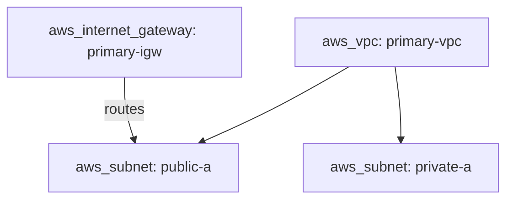

# Generating `design/views/*.md`

Views are always regenerated wholesale from `design/model.yaml` — never hand-edited, never partially patched. If a
view file exists and the model has changed, regenerate the whole file.

## Staleness marker (required)

The CI drift check (see [pr-workflow.md](pr-workflow.md)) can't re-run the AI generation step itself — it's a
plain script. Instead, every generated file (`design/views/*.md` and `design/README.md`) must start with a
hash marker tying it to the exact model content it was generated from:

```markdown
<!-- generated-from-model-sha256: <sha256 of design/model.yaml at generation time> -->
```

Compute the hash with `sha256sum design/model.yaml` (or equivalent) and write the marker as the first line of
every generated file, every time you regenerate. The CI script recomputes the current model's hash and fails if
any generated file's marker doesn't match — that's the mechanical proof the committed views reflect the
committed model, without CI needing to run the generation logic itself.

## The fixed six

Always produce all six, even when a view has little or nothing to show. An empty or thin view is a legitimate
signal (e.g., "the doc said nothing about security groups at all") — don't skip generating it just because few
resources map to it.

| View | File | Format | Why this format |
|---|---|---|---|
| Networking | `views/networking.md` | Mermaid diagram | Relationships (subnets, routing, peering) are the point |
| Security/IAM | `views/security.md` | Table | Attribute-heavy (policies, encryption settings); a diagram box can't hold a policy statement legibly |
| Compute/Application | `views/compute.md` | Mermaid diagram | Relationships (what calls what, scaling topology) matter |
| Data/Storage | `views/data.md` | Table | Attribute-heavy (retention, backup, encryption) |
| Integration/Messaging | `views/integration.md` | Mermaid diagram | Relationships (queues, event flow, API calls) are the point |
| Observability/Ops | `views/observability.md` | Table | Attribute-heavy when present; expect this one sparse — that's fine, don't force content |

## Diagram views (Mermaid)

Use `graph TD` or `flowchart TD` with one node per resource in that view's scope, edges labeled with the
relationship's `kind`. Example, for Networking:



Rules:

- Node label = `<resource type>: <id>` — always show the Terraform type, since that's the vocabulary the review
  is validating against.
- A resource with any `MISSING`/`AMBIGUOUS` field gets a `⚠` prefix on its node label and (if Mermaid styling is
  supported by the rendering target) a distinct class, e.g. `class web_app_primary flagged` with a `flagged`
  style defined in the diagram — so gaps are visible without opening the model.
- Keep one diagram per view file. If a view genuinely needs more than ~15–20 nodes to stay legible, split by a
  natural sub-boundary (e.g., per-environment) rather than cramming — but this should be rare for a single app
  team's architecture doc.

## Table views (Security, Data, Observability)

One row per resource in that view's scope, one column per attribute that's actually populated across the
resources in that view (don't force every resource into identical columns if their attributes genuinely differ —
prefer a slightly ragged table over inventing "N/A" filler).

```markdown
| Resource | Type | Encryption | Access | Notes |
|---|---|---|---|---|
| orders-table | aws_dynamodb_table | ⚠ MISSING | web-app-primary (read/write) | |
| user-sessions | aws_elasticache_cluster | at-rest, in-transit | web-app-primary | Confirmed 2026-07-12 |
```

Rules:

- Any `MISSING`/`AMBIGUOUS` field renders as `⚠ MISSING` / `⚠ AMBIGUOUS — <reason>` directly in the cell — never
  blank, never silently omitted.
- Sort rows by resource `id` for stable diffs across regenerations.

## `design/README.md`

Regenerate alongside the views. Short index: one line on what this is, a bullet list linking to each of the six
view files, and a rendered list of any open `open_items` with links to their GitHub Issues once filed (see
[pr-workflow.md](pr-workflow.md)).
